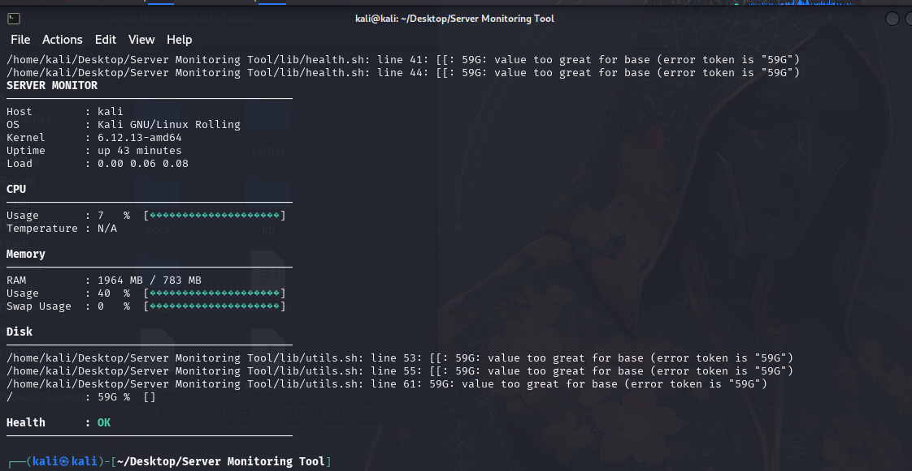

# Server Monitoring Tool



A professional, lightweight Bash-based server monitoring utility for Linux systems.

## Features

- **Real-time Dashboard:** Clean, responsive terminal UI
- **CLI Mode:** Non-interactive querying of individual metrics
- **Watch Mode:** Continuous monitoring with configurable intervals
- **Health Evaluation:** Configurable thresholds for CPU, RAM, Disk, and Load
- **JSON Output:** Machine-readable output for integrations
- **Modular Architecture:** Clean separation of concerns
- **No Dependencies:** Built with standard Linux utilities

## Supported Distributions

- Ubuntu
- Debian
- Linux Mint
- Fedora
- CentOS / RHEL / Rocky / AlmaLinux
- Arch Linux

## Installation

```bash
sudo make install
```

## Usage

```bash
server-monitor
server-monitor --dashboard
server-monitor --cpu
server-monitor --json
server-monitor --watch
```

For more details, see [docs/usage.md](docs/usage.md).

## Configuration

The default configuration file is installed to `/etc/server-monitor.conf`.
You can customize thresholds, logging, and monitored services.

## License

MIT License

Copyright (c) 2026 XREFS0

---

### 🌐 Connect with Me

<p align="left">
  <a href="http://xrefs0.com/" target="_blank">
    
  </a>
  <a href="https://www.facebook.com/XREFS0" target="_blank">
    
  </a>
  <a href="https://t.me/MrMasaOfficial" target="_blank">
    
  </a>
  <a href="https://t.me/XREFS0_CHANNEL" target="_blank">
    
  </a>
  <a href="https://www.youtube.com/@XREFS0" target="_blank">
    
  </a>
</p>

